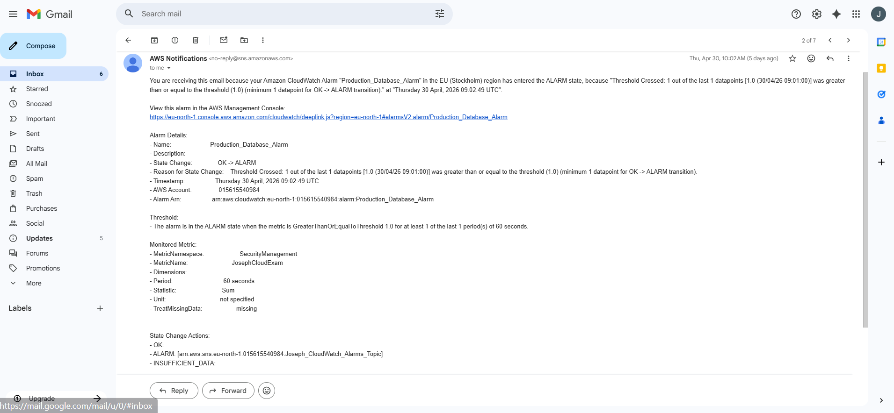
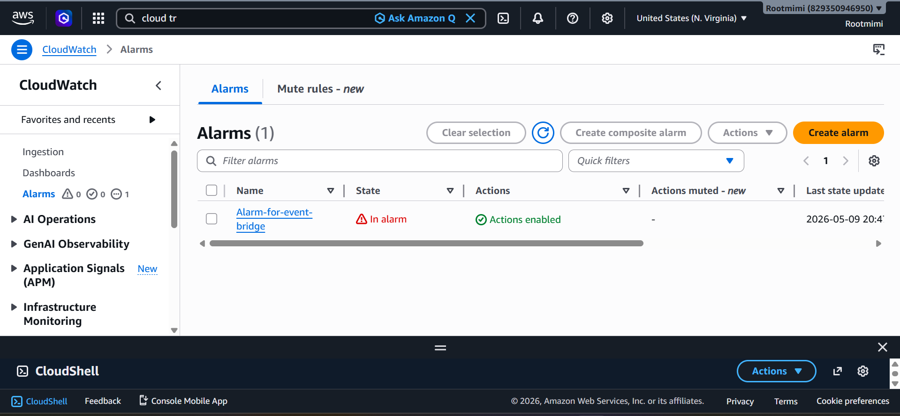

# AWS Honeytoken Detection & Automated Kill-Switch

**Category:** Cloud Security | Threat Detection & Automated Response
**Platform:** AWS (eu-north-1)
**Status:** Complete detection and auto-remediation verified end-to-end

---

## Incident Ticket

| Field | Detail |
|---|---|
| Simulated Asset | `Production_Database_Credentials` (honeytoken secret) |
| Trigger Event | `GetSecretValue` on AWS Secrets Manager |
| Detection Method | Dual-path: CloudWatch Alarms + EventBridge |
| Response | Automated IAM policy detachment (Lambda kill-switch) |
| Outcome | Unauthorized user detected, alerted, and quarantined automatically |

---

## Objective

Build a cloud security monitoring setup that detects unauthorized access to sensitive credentials and automatically contains the threat without a human in the loop using a honeytoken as bait.

## Architecture

**Detection Flow 1 - CloudWatch:**
CloudTrail logs all API activity (multi-region) → S3 + CloudWatch Logs → CloudWatch Metric Filter watches for `GetSecretValue` on the honeytoken → CloudWatch Alarm fires → SNS sends email alert.

**Detection Flow 2 - EventBridge:**
CloudTrail events → EventBridge rule matches `GetSecretValue` on the honeytoken directly → fires two targets in parallel: SNS (email alert) + Lambda (kill-switch).

**Automated Response:**
Lambda function (`Joseph_Lambda_Function`) is triggered by the EventBridge rule, uses the IAM API (`DetachUserPolicy`) to strip all permissions from the offending user quarantining them in near real-time.

## Tools & Services Used

- AWS CloudTrail (multi-region API logging)
- AWS Secrets Manager (honeytoken)
- Amazon CloudWatch (Metric Filters, Alarms, Logs)
- Amazon EventBridge (event-driven rule matching)
- Amazon SNS (real-time email alerting)
- AWS Lambda + IAM (automated remediation)

## Implementation

1. Created a fake secret, `Production_Database_Credentials`, in Secrets Manager as bait.
2. Enabled CloudTrail across all regions, logging to both an S3 bucket and CloudWatch Logs.
3. **Flow 1:** Built a CloudWatch Metric Filter to watch for `GetSecretValue` events on the honeytoken, backed by a CloudWatch Alarm wired to an SNS topic for email alerts.
4. **Flow 2:** Built an EventBridge rule matching the same event directly off CloudTrail, with two targets an SNS topic and a Lambda function.
5. Built the Lambda kill-switch: on invocation, it calls `DetachUserPolicy` against the offending IAM user, removing all attached permissions.
6. Simulated the attack using a test IAM user (`Victim_IAM_User`) and validated the full chain: secret access → detection → alert → automated quarantine.

## Evidence

- CloudTrail JSON log showing `GetSecretValue` against the honeytoken, with event time, user identity, and source IP captured.
- CloudWatch Alarm configuration and resulting email alert (Flow 1).
- EventBridge rule configuration and resulting email alert (Flow 2).
- IAM console screenshot confirming zero attached policies on `Victim_IAM_User` post-kill-switch.
- Follow-up CloudTrail log showing `AccessDenied` when the quarantined user attempted `ListBuckets` proof the kill-switch held.

## Security Analysis

**Detection speed:** EventBridge reacted within seconds of the honeytoken being accessed, since it consumes CloudTrail events directly. CloudWatch's metric-filter path lagged by roughly 3–5 minutes due to log ingestion, metric evaluation, and alarm state-change delays.

**Alert quality:** The EventBridge-driven alert carried more forensic detail out of the box, exact IAM username, event time, and source IP versus the more generic CloudWatch alarm notification.

**Compliance angle:** This design maps to NIST continuous monitoring expectations  CloudTrail provides full audit coverage, CloudWatch/EventBridge provide near-real-time detection, and the Lambda kill-switch provides the automated response leg.

## Lessons Learned

For a latency-sensitive environment like banking, **EventBridge → Lambda is the safer pattern for triggering automated kill-switches** a 3–5 minute detection lag on the CloudWatch path is an unacceptable exposure window if the target is production credentials. CloudWatch still has value as a dashboarding/backup layer, but shouldn't be the primary trigger for automated containment in a high-stakes setting.

## Skills Demonstrated

`Threat Detection` `Cloud Security Monitoring` `Incident Response Automation` `AWS CloudTrail / CloudWatch / EventBridge / Lambda / IAM` `Honeytoken Deployment` `Forensic Log Analysis` `NIST Continuous Monitoring Alignment`
