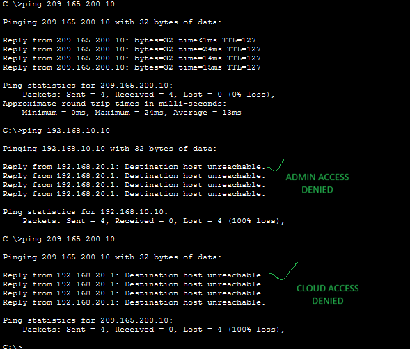

# 📡 Secure Branch Office Network Design – VLAN Segmentation, Inter-VLAN Routing & ACLs

## 🎯 Objective
To design and simulate a secure branch office infrastructure using Cisco Packet Tracer, implementing VLAN segmentation, inter-VLAN routing, and Access Control Lists (ACLs).

---

## 🏢 Scenario

A company branch office includes three departments connected to the same physical switch:

- Admin Department (HR & Finance)
- Sales Department
- IT Support Department

Security Requirements:
- Admin must access the cloud payroll system.
- Sales must NOT access Admin resources.
- IT Support should have full access across the network.

---

## 🚨 Security Risk of Not Separating Departments

If departments are not segmented:

- Sales users could access sensitive HR/Finance records.
- Malware could spread across the entire network.
- Sensitive payroll data could be exposed.
- The company risks legal and financial consequences.

VLAN segmentation reduces this risk by isolating departments and limiting access.

---

## 🌐 VLAN Configuration

- VLAN 10 – Admin (192.168.10.0/24)
- VLAN 20 – Sales (192.168.20.0/24)
- VLAN 30 – IT (192.168.30.0/24)

Each VLAN was assigned a default gateway on the router.

---

## 🔌 Access Port Configuration (Switch CLI)

```bash
enable
configure terminal
vlan 10
name ADMIN
interface fastEthernet 0/1
switchport mode access
switchport access vlan 10
no shutdown
```

Each department device was assigned to its respective VLAN.

---

## 🔁 Inter-VLAN Routing (Router-on-a-Stick)

Devices in different VLANs cannot communicate directly.

Inter-VLAN routing was implemented using router sub-interfaces configured for:

- VLAN 10
- VLAN 20
- VLAN 30

Each sub-interface was assigned an IP address to act as the default gateway.

Traffic flow:
1. Device sends traffic to default gateway.
2. Router checks routing table.
3. ACL determines whether traffic is allowed or denied.

---

## 🔀 Trunk Port Configuration

A trunk port was configured between the switch and router to:

- Carry traffic from multiple VLANs
- Enable inter-VLAN routing
- Maintain VLAN tagging

---

## 🔐 ACL Implementation

### ✅ Allow:
- IT VLAN → Full access to all VLANs
- Admin VLAN → Access to cloud payroll system

### ❌ Deny:
- Sales VLAN → Access to Admin VLAN
- Sales VLAN → Access to cloud payroll system

### ✅ Allow:
- Sales VLAN → Access to IT Support resources only

---

## 🧪 ACL Verification (Ping Tests)

### ✅ Admin Accessing Cloud Payroll

```bash
ping 209.165.200.10
```

Result: 0% packet loss (Access Successful)

---

### ❌ Sales Attempting to Access Admin

```bash
ping 192.168.10.10
```

Result: Destination host unreachable (Access Denied)

---

### ❌ Sales Attempting to Access Cloud Payroll

```bash
ping 209.165.200.10
```

Result: Destination host unreachable (Access Denied)

---

## 📸 Evidence of ACL Enforcement


---

## 🛡️ Security Principles Applied

- Network Segmentation
- Least Privilege
- Access Control Enforcement
- Department-Based Isolation
- Defense-in-Depth Strategy

---

## 📚 What I Learned

- How VLAN segmentation protects sensitive systems
- How Router-on-a-Stick enables inter-VLAN routing
- How ACLs enforce business security policies
- The importance of validating security configurations
