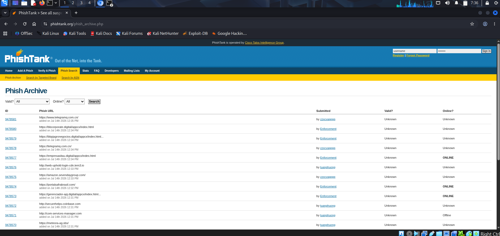
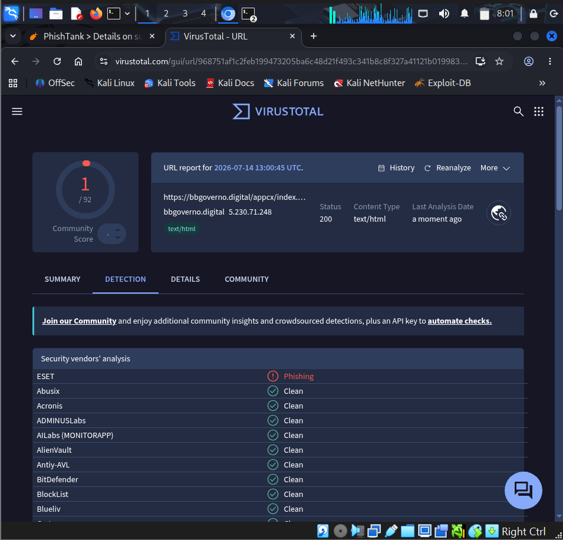
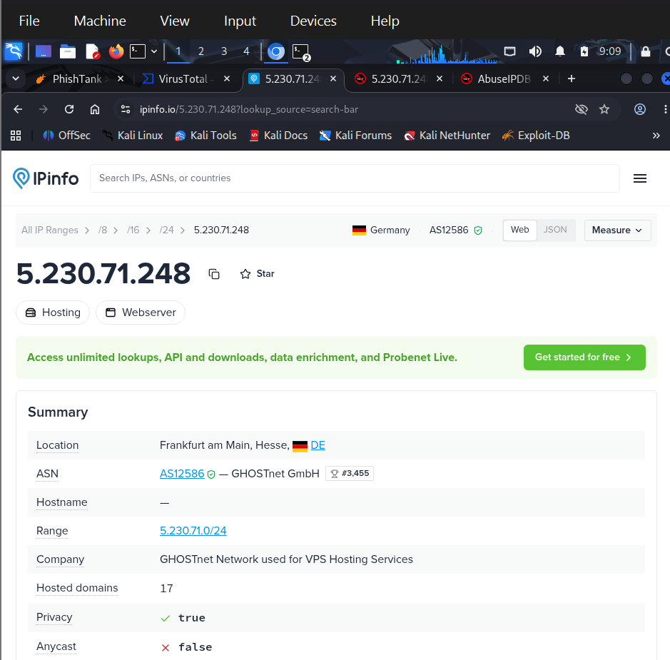
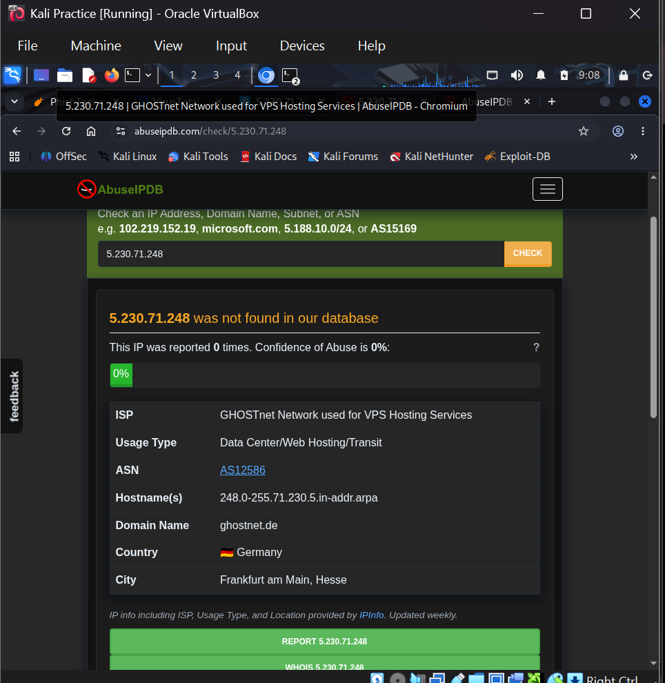

# 🛡️ SOC Analyst Phishing Investigation Lab

## 📌 Project Overview

This project documents a phishing investigation performed in a controlled lab environment using Kali Linux. The objective was to analyze a reported phishing website, collect Indicators of Compromise (IOCs), perform threat intelligence analysis, and produce a professional investigation report.

---

## 🎯 Objectives

- Investigate a reported phishing URL
- Verify the threat using open-source intelligence (OSINT)
- Collect Indicators of Compromise (IOCs)
- Perform DNS, WHOIS, and HTTP analysis
- Investigate the hosting infrastructure
- Document findings in a professional report

---

## 🛠️ Lab Environment

| Component | Details |
|-----------|---------|
| Operating System | Kali Linux |
| Virtualization | Oracle VirtualBox |
| Internet Access | Enabled |
| Investigation Type | Phishing URL Investigation |

---

## 🧰 Tools Used

- Kali Linux
- Oracle VirtualBox
- PhishTank
- VirusTotal
- IPinfo
- AbuseIPDB
- dig
- whois
- curl

---

## 🔍 Investigation Workflow

### Phase 1 — PhishTank Verification

The reported phishing URL was verified using PhishTank to confirm it had been reported by the security community.

### Phase 2 — VirusTotal Analysis

The URL was submitted to VirusTotal to determine detection rates from multiple security vendors.

### Phase 3 — DNS Investigation

DNS records were collected using:

- A Record
- NS Record
- MX Record
- TXT Record

### Phase 4 — WHOIS Investigation

WHOIS information was gathered to identify:

- Domain registration details
- Nameservers
- Registrar information

### Phase 5 — HTTP Header Analysis

HTTP response headers were analyzed using `curl`.

### Phase 6 — Infrastructure Investigation

Hosting infrastructure was investigated using:

- IPinfo
- AbuseIPDB

---

# 📊 Indicators of Compromise (IOCs)

| Indicator | Value |
|-----------|-------|
| Domain | bbgoverno.digital |
| IP Address | 5.230.71.248 |
| Nameservers | ns1.dyna-ns.net |
| | ns2.dyna-ns.net |

---

# 📝 Investigation Findings

- The phishing website was active during analysis.
- VirusTotal identified the URL as phishing.
- The domain resolved to **5.230.71.248**.
- The infrastructure was hosted by **GHOSTnet GmbH**.
- IP geolocation pointed to **Frankfurt, Germany**.
- AbuseIPDB showed no prior abuse reports for the IP at the time of investigation.
- DNS analysis identified two authoritative nameservers.

---

# 🛡️ MITRE ATT&CK Mapping

| Tactic | Technique |
|---------|-----------|
| Initial Access | T1566.002 – Phishing: Link |
| Resource Development | T1583 – Acquire Infrastructure |

---

# 📂 Project Structure

```
SOC-Phishing-Investigation-Lab
│
├── Evidence
├── IOC_Report
├── Screenshots
├── URL_Analysis
├── WHOIS
├── README.md
└── LICENSE
```

---

# 📸 Investigation Screenshots

## 1. PhishTank Verification



---

## 2. VirusTotal Analysis



---

## 3. IPinfo Infrastructure Analysis



---

## 4. AbuseIPDB Reputation Check



---

# 📁 Project Reports

This repository includes:

- IOC Report
- Investigation Report
- WHOIS Results
- DNS Enumeration
- HTTP Header Analysis
- Investigation Notes

---

# 💡 Skills Demonstrated

- Threat Intelligence
- Phishing Investigation
- IOC Collection
- DNS Enumeration
- WHOIS Analysis
- HTTP Header Analysis
- Linux Command Line
- Threat Hunting
- Security Documentation
- Incident Reporting

---

# 📚 Key Learning Outcomes

Through this investigation I learned how to:

- Validate phishing indicators using OSINT.
- Collect and document Indicators of Compromise.
- Investigate malicious infrastructure.
- Perform DNS and WHOIS analysis.
- Analyze HTTP response headers.
- Produce professional SOC investigation documentation.

---

# ⚠️ Disclaimer

This project was completed in a controlled lab environment for educational purposes only. No unauthorized exploitation or interaction with the target infrastructure was performed. All analysis relied on publicly available information and passive investigation techniques.
