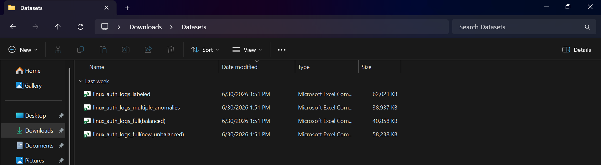
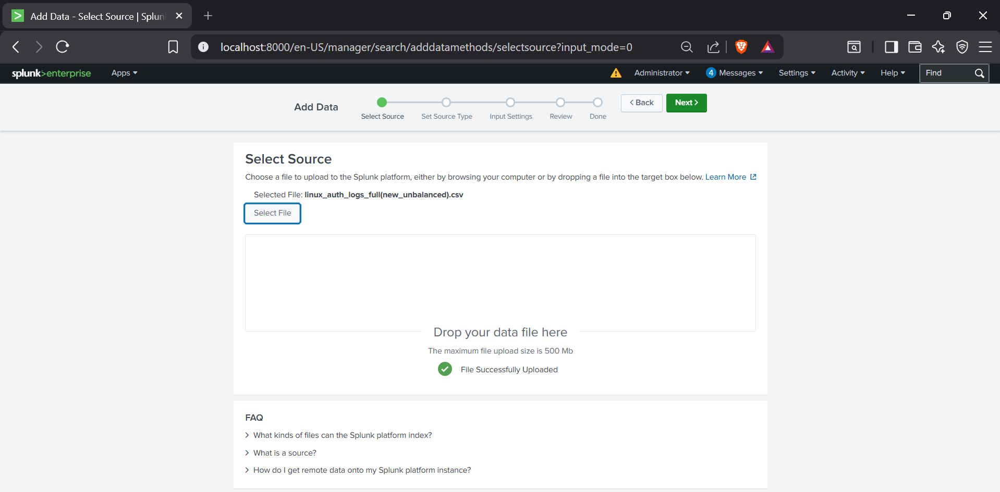
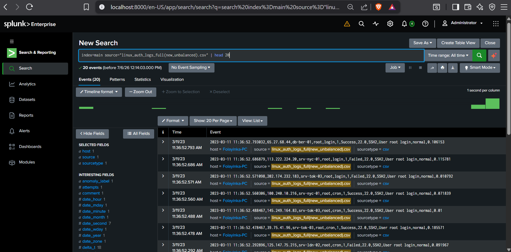
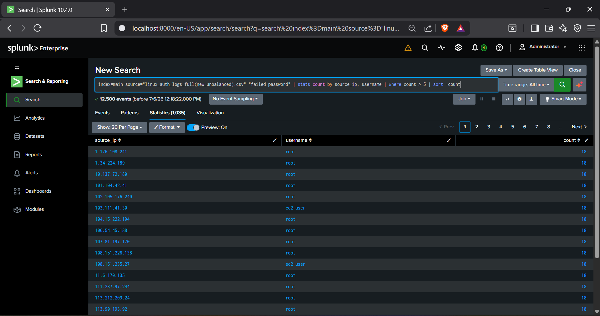
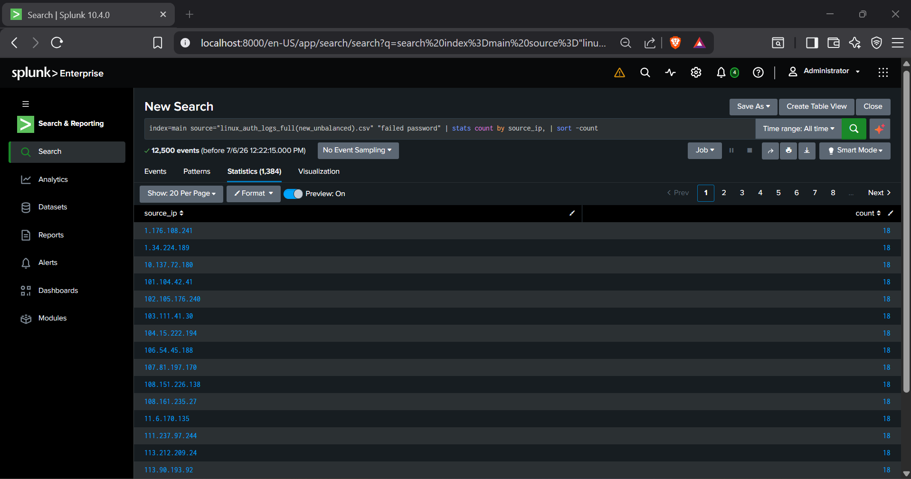
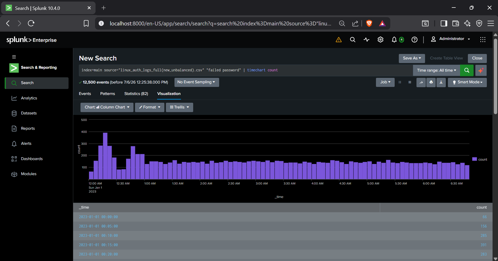

# SSH Brute-Force Detection with Splunk

Detecting and triaging SSH brute-force activity from Linux authentication logs using Splunk Search Processing Language (SPL).

## Objective

Simulate a SOC Level 1 workflow: ingest raw Linux SSH auth logs into Splunk, then build SPL queries that surface brute-force patterns repeated failed logins, high-volume source IPs, and time-based attack spikes the way an analyst would triage a "multiple failed logins" alert in a real SIEM.

## Environment & Tools

| Component | Details |
|---|---|
| SIEM | Splunk Enterprise 10.4.0 |
| Data source | Synthetic Linux SSH authentication logs (CSV) |
| Index | `main` |
| Log fields | `source_ip`, `host`, `username`, `attempts`, `result` (Success/Failed), `anomaly_label`, timestamp breakdowns (`date_hour`, `date_mday`, `date_wday`, etc.) |

## Dataset

Four related datasets were prepared for this lab to test detection logic against different data shapes:

- `linux_auth_logs_labeled.csv`
- `linux_auth_logs_multiple_anomalies.csv`
- `linux_auth_logs_full(balanced).csv`
- `linux_auth_logs_full(new_unbalanced).csv` ← used for this lab (58,238 KB, 12,500+ events)

  

The unbalanced dataset was chosen deliberately real-world auth logs are overwhelmingly normal traffic with a small proportion of malicious activity, so this dataset better reflects what an analyst actually triages.

## Methodology

### 1. Ingest and validate the data

Uploaded the CSV through Splunk's Add Data wizard (Select Source → Set Source Type → Input Settings → Review → Done), then confirmed successful indexing with a quick preview:



```spl
index=main source="linux_auth_logs_full(new_unbalanced).csv" | head 20
```



This confirmed the event structure timestamp, source IP, hostname, username, action, attempt number, and result before building any detection logic on top of it.

### 2. Identify brute-force IP/username pairs

```spl
index=main source="linux_auth_logs_full(new_unbalanced).csv" "failed password"
| stats count by source_ip, username
| where count > 5
| sort -count
```



Groups failed login attempts by the specific IP-to-username pair being targeted. A `count > 5` threshold filters out normal noise (occasional typos, expired credentials) and isolates sustained password-guessing behavior. Multiple source IPs returned exactly 18 failed attempts against `root` and `ec2-user` — a strong signal of scripted/automated brute-force tooling rather than a human mistyping a password.

### 3. Identify the most aggressive source IPs

```spl
index=main source="linux_auth_logs_full(new_unbalanced).csv" "failed password"
| stats count by source_ip
| sort -count
```



Collapses the same failed-login events down to source IP alone, ranking attackers by total volume regardless of which account they targeted. This is the view used to build a blocklist or feed a firewall/IPS rule.

### 4. Establish the attack timeline

```spl
index=main source="linux_auth_logs_full(new_unbalanced).csv" "failed password"
| timechart count
```



Buckets failed-login volume into 5-minute intervals across the dataset. This surfaces burst activity — e.g. a jump from ~85 events to 391 events within a 15-minute window which helps pinpoint when an attack campaign started and whether it was a single wave or sustained over time.

## Key Findings

- 12,500 "failed password" events matched across the dataset.
- A consistent pattern of exactly 18 failed attempts per source IP against `root`/`ec2-user` accounts pointed to automated brute-force tooling rather than organic user error.
- Timechart analysis revealed clear volume spikes rather than a flat baseline, consistent with active brute-force campaigns hitting the host in bursts.

## MITRE ATT&CK Mapping

| Technique | ID |
|---|---|
| Brute Force: Password Guessing | T1110.001 |
| Valid Accounts | T1078 |


## Lessons Learned

- **Thresholds need context, not just numbers.** A flat `count > 5` filter works for this dataset, but in production the right threshold depends on the account (a `root` login attempt is more sensitive than a shared low-privilege account) and the normal baseline for that host.
- **Grouping by source_ip alone vs. source_ip + username tells different stories.** The IP-only view is better for network-level blocking; the IP+username view is better for understanding which accounts are actually being targeted. Both were needed neither alone gives the full picture.
- **Timechart is where the "story" actually shows up.** The stats tables told me *what* was happening; the timechart told me *when* and *how intensely* that distinction matters when writing an incident timeline for a report.
- **Working with an unbalanced dataset was more realistic and messier.** It would have been easier to just use the balanced dataset, but starting from noisy, unbalanced data forced me to build filtering logic instead of relying on the data already being "clean," which is closer to what real log ingestion looks like.

## Skills Demonstrated

- SPL query construction (`stats`, `where`, `timechart`, field extraction)
- Log ingestion and source validation in Splunk
- Brute-force / credential-stuffing pattern recognition
- Building analyst workflows around thresholds rather than raw event review
- Translating raw findings into a MITRE ATT&CK-mapped narrative

