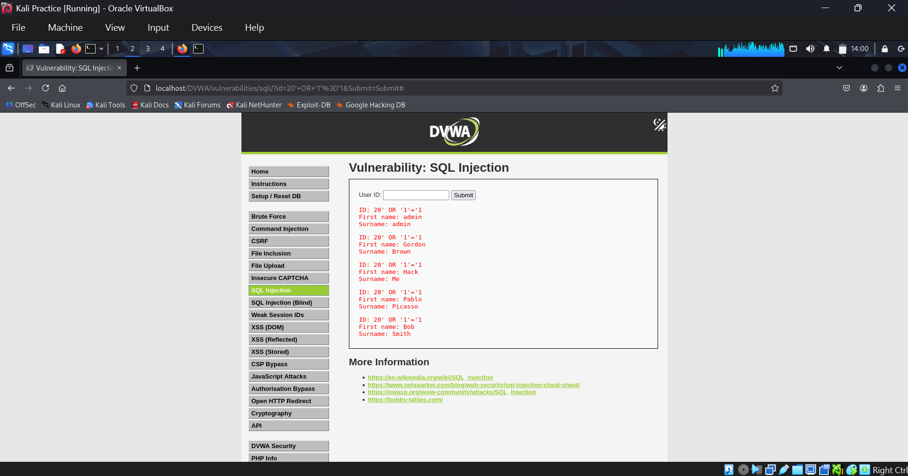
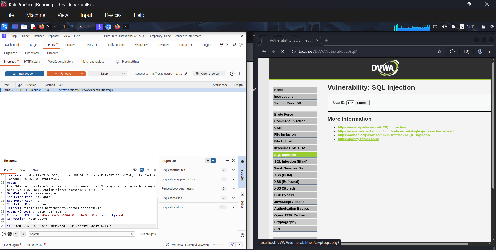
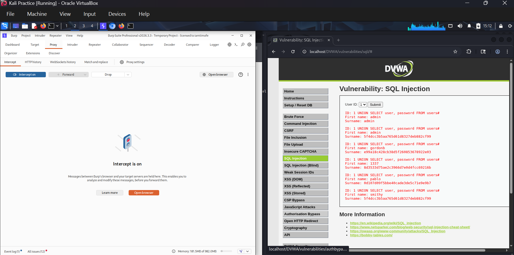
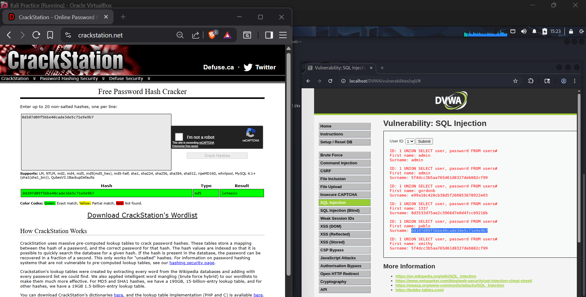
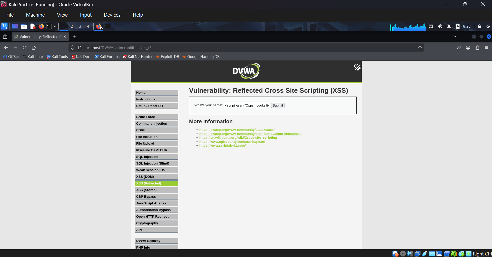
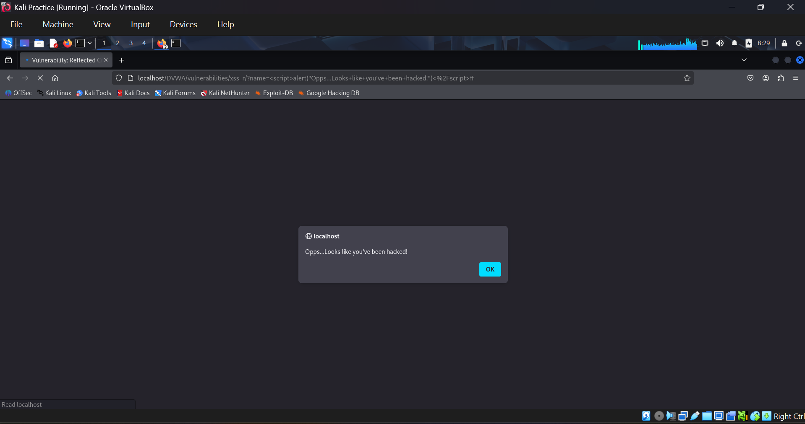
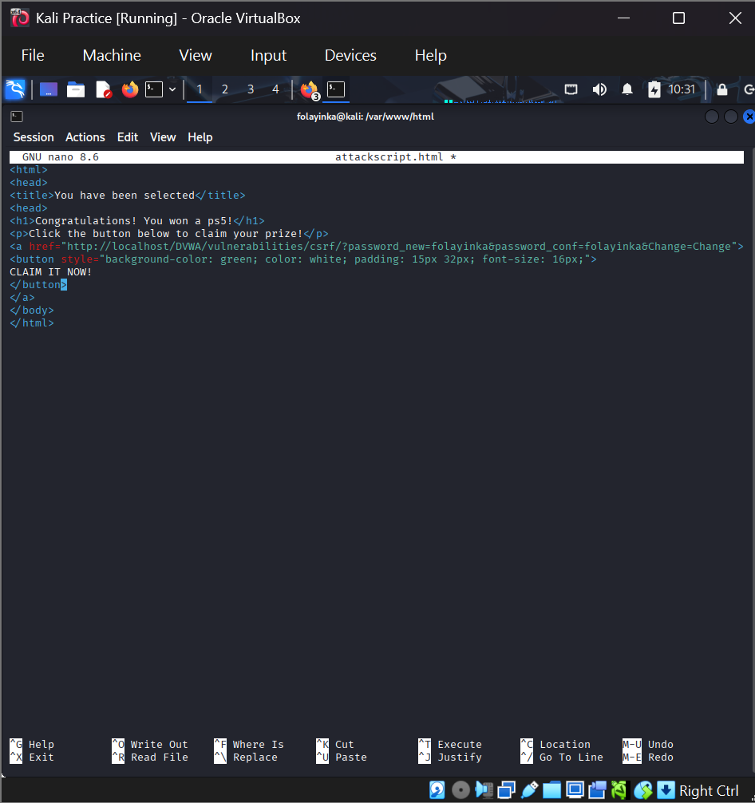
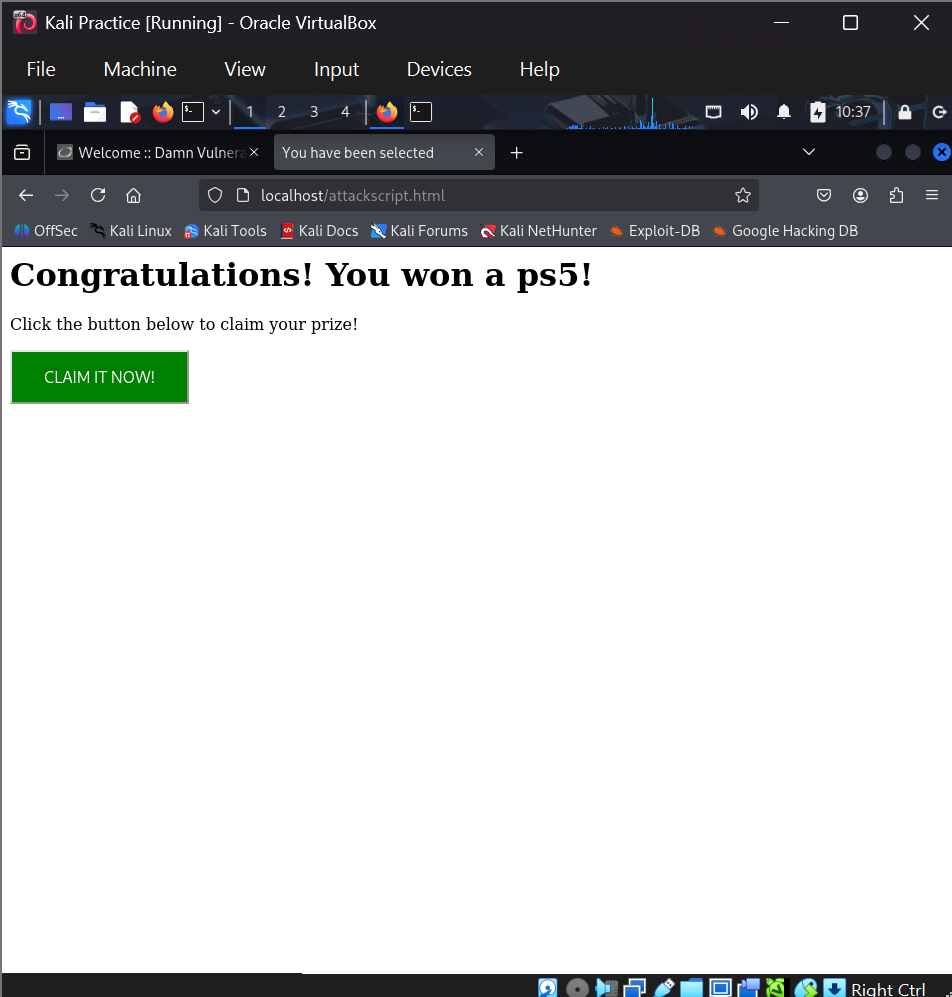
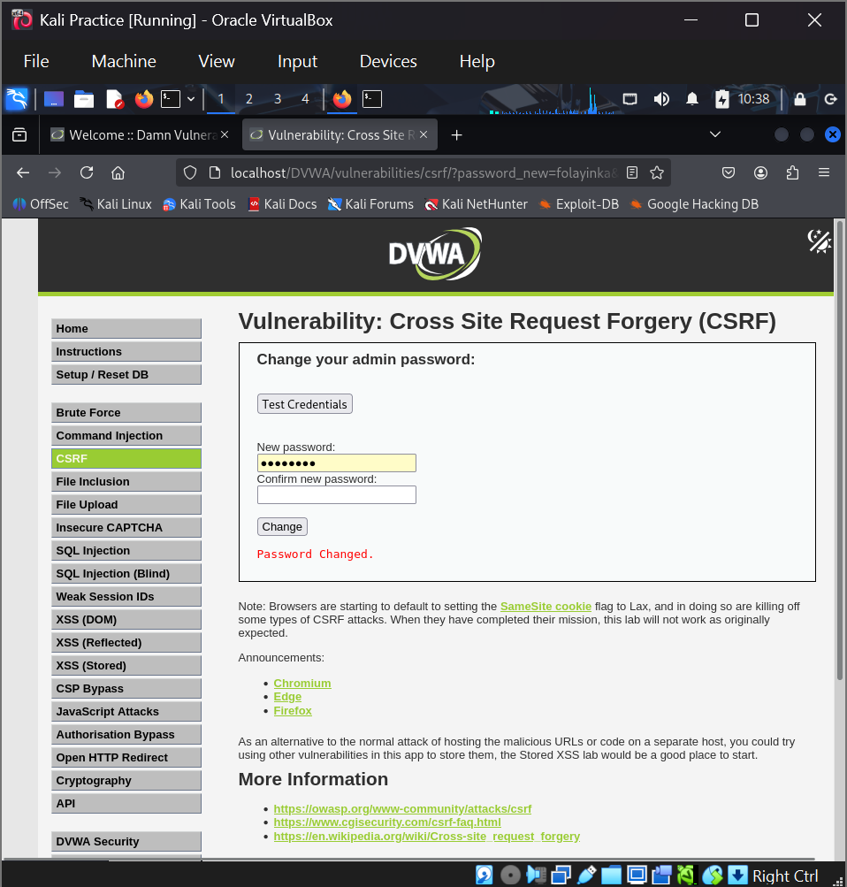

# Web Application Vulnerabilities & Exploitation DVWA.

A hands-on penetration test against DVWA (Damn Vulnerable Web Application) covering three OWASP Top 10 categories. SQL Injection, Cross-Site Scripting, and CSRF/Broken Authentication with full exploitation, impact analysis, and remediation guidance for each.

## Objective

Discover and exploit common web application vulnerabilities in a controlled lab environment, analyze their real-world impact against the CIA triad, and produce developer-facing remediation guidance the core workflow of an application security assessment.

## Environment & Tools

| Component | Details |
|---|---|
| Target | DVWA (Damn Vulnerable Web Application) |
| Attack VM | Kali Linux |
| Tools | Burp Suite Professional, CrackStation, Firefox |
| Vulnerability classes | SQL Injection, Reflected XSS, CSRF |

## Part 1 - Vulnerability Discovery & Exploitation

### 1. SQL Injection (Low & Medium Security)

**Category:** OWASP Top 10 - A03: Injection

**Low security:** Logged into DVWA and navigated to the SQL Injection module. Submitted the payload `20' OR '1'='1` in the User ID field. The application returned multiple user records (admin, Gordon Brown, Hack Me, etc.) instead of a single result, confirming user input was being concatenated directly into the SQL query without sanitization.



**Medium security:** Intercepted the request in Burp Suite and modified the parameter with a UNION-based payload:

```sql
id=1' UNION SELECT user, password FROM users#&Submit=Submit
```





The application returned usernames alongside hashed passwords. The hashes were cracked using CrackStation to recover plaintext credentials, demonstrating full account compromise from a single injection point.



### 2. Cross-Site Scripting - Reflected (Low Security)

**Category:** OWASP Top 10 - A03: Injection (Client-Side)

Submitted the following payload into the DVWA Reflected XSS input field:

```html
<script>alert("Opps...Looks like you've been hacked!")</script>
```



The application reflected the input back into the page without encoding or sanitization, and the browser executed the injected JavaScript, firing an alert box confirming the input was rendered as executable code rather than plain text.



### 3. CSRF / Broken Authentication (Low Security)

**Category:** OWASP Top 10 - A01: Broken Access Control

Observed that DVWA's password-change request contained no CSRF token. Built a malicious HTML page disguised as a prize-claim site and hosted it locally (`/var/www/html/attackscript.html`):

```html
<a href="http://localhost/DVWA/vulnerabilities/csrf/?password_new=folayinka&password_conf=folayinka&Change=Change">
  <button>CLAIM IT NOW!</button>
</a>
```



While already authenticated to DVWA in the browser, visiting the page and clicking the button submitted the forged request.



The account's password was silently changed to `folayinka` with no confirmation and no interaction with the real DVWA interface demonstrating a complete CSRF-driven account takeover.



## Part 2 — Vulnerability Analysis & Impact

| Vulnerability | Root Cause | Confidentiality | Integrity | Availability | Severity |
|---|---|---|---|---|---|
| SQL Injection | Unsanitized input concatenated directly into SQL queries | Full data read (credentials, PII) | Records can be modified/deleted | Tables could be dropped | **Critical** |
| Reflected XSS | User input reflected into the page without output encoding | Session cookie / data theft | Page content and forms can be altered | Persistent variants can disrupt UX | **High** |
| CSRF | No anti-CSRF tokens; weak session validation | Unauthorized account access | Credentials/settings changed without consent | Accounts can be locked out | **High** |

**Real-world scenarios:** SQL Injection could lead to full customer database exfiltration and account takeover at scale. XSS enables session hijacking and phishing via injected scripts. CSRF allows attackers to silently hijack accounts by tricking authenticated users into clicking a single link.

## Part 3 - Remediation & Defense

### SQL Injection
- Use parameterized queries / prepared statements instead of string concatenation:
  ```python
  cursor.execute("SELECT * FROM users WHERE id = ?", (user_id,))
  ```
- Enforce least-privilege database accounts and disable verbose SQL error messages.
- Reference: OWASP SQL Injection Prevention Cheat Sheet

### Cross-Site Scripting
- Apply output encoding on all user-supplied data before rendering.
- Set a Content-Security-Policy header to restrict inline script execution.
- Use `HttpOnly` and `Secure` cookie flags to limit cookie theft via JavaScript.
- Reference: OWASP XSS Prevention & DOM-Based XSS Prevention Cheat Sheets

### CSRF / Broken Authentication
- Implement per-session anti-CSRF tokens on all state-changing requests.
- Set cookies with `SameSite=Strict` or `Lax`.
- Validate `Origin`/`Referer` headers on sensitive actions.
- Enforce short session expiry, regenerate session IDs on login, and consider MFA for critical actions.
- Reference: OWASP CSRF Prevention, Session Management, and Authentication Cheat Sheets

## Reflection

CSRF was the hardest of the three to exploit, unlike SQL Injection and XSS, which give immediate, visible feedback, CSRF required understanding how authenticated sessions work and building a convincing delivery mechanism (the fake prize page) before the impact was demonstrable.

This assessment reinforced how closely offensive and defensive security are linked: exploiting each vulnerability directly informed which controls actually matter (parameterized queries, output encoding, anti-CSRF tokens) rather than treating remediation as a checklist. It also highlighted how manual testing (payload crafting, Burp Suite request tampering) and automated tools like SQLMap complement each other manual testing surfaces business-logic issues automation can miss, while automation accelerates coverage across a larger attack surface.

## Skills Demonstrated

- Manual exploitation of SQL Injection, XSS, and CSRF
- Burp Suite request interception and parameter tampering
- Hash cracking and credential recovery workflows
- CIA triad-based impact analysis
- OWASP-aligned remediation and secure coding guidance

---

