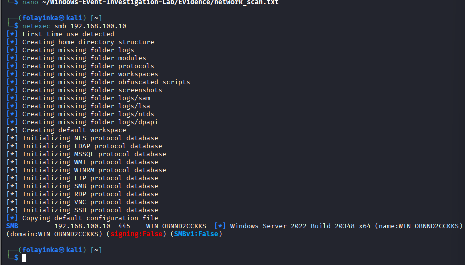
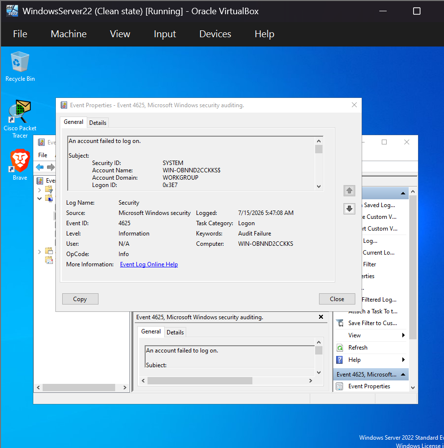
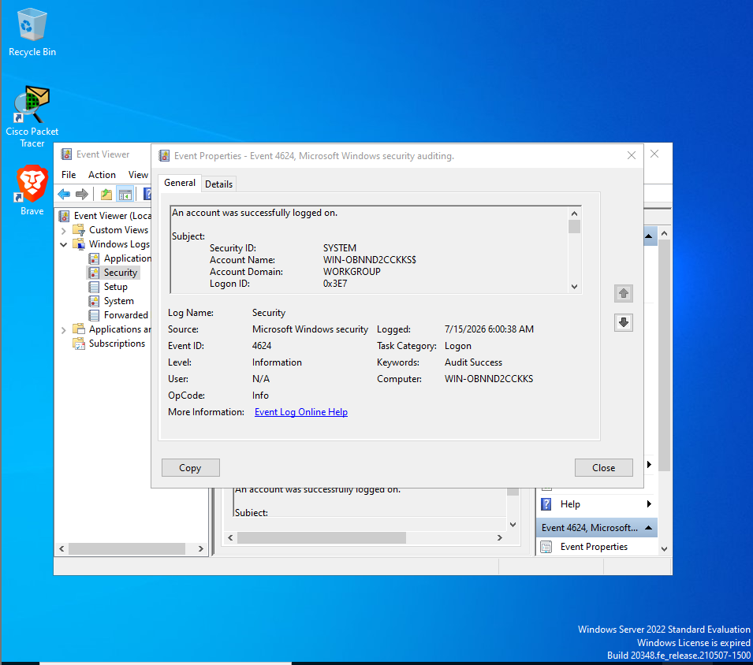
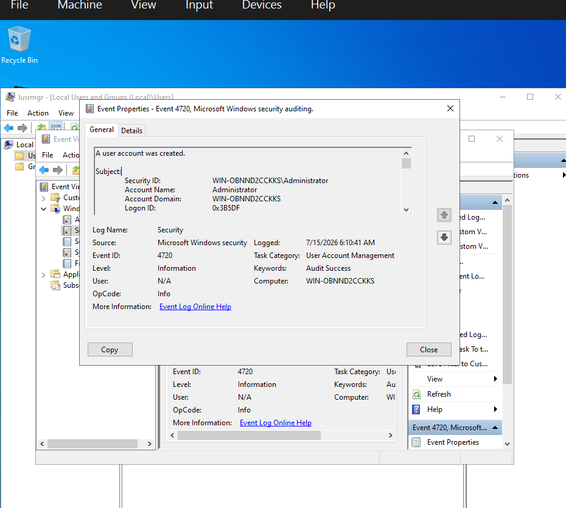
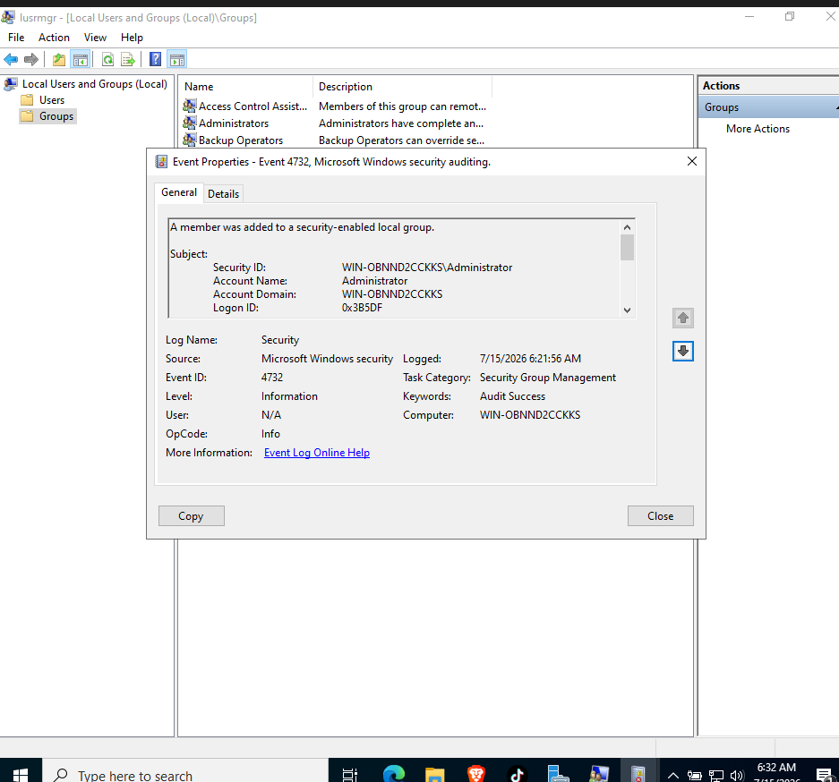
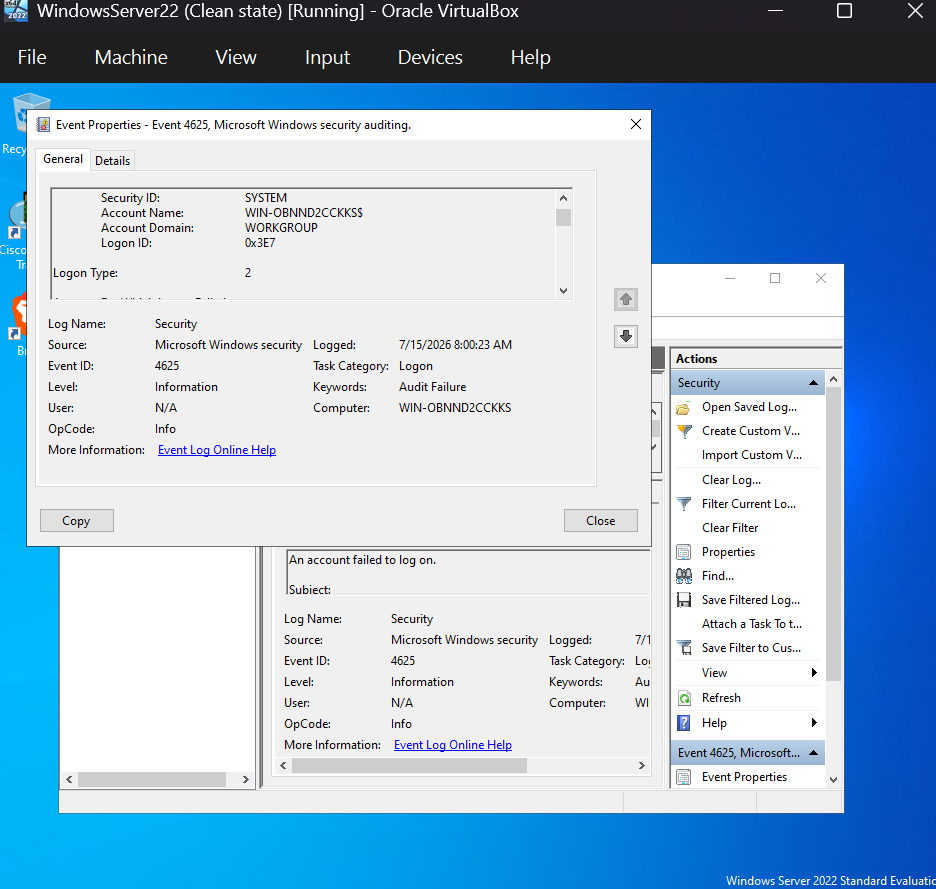

# 🛡️ Windows Security Event Investigation Lab


---

# Table of Contents

- [Project Overview](#project-overview)
- [Lab Environment](#lab-environment)
- [Tools Used](#tools-used)
- [Investigation Workflow](#investigation-workflow)
- [Investigation Phases](#investigation-phases)
  - [Phase 1: Network Enumeration](#phase-1-network-enumeration)
  - [Phase 2: Failed Logon Investigation](#phase-2-failed-logon-investigation)
  - [Phase 3: Successful Logon Investigation](#phase-3-successful-logon-investigation)
  - [Phase 4: User Account Creation Investigation](#phase-4-user-account-creation-investigation)
  - [Phase 5: Privilege Escalation Investigation](#phase-5-privilege-escalation-investigation)
  - [Phase 6: Remote SMB Authentication Investigation](#phase-6-remote-smb-authentication-investigation)
- [Investigation Timeline](#investigation-timeline)
- [Event Summary](#event-summary)
- [MITRE ATT&CK Mapping](#mitre-attck-mapping)
- [Indicators of Compromise (IOCs)](#indicators-of-compromise-iocs)
- [Evidence and Screenshots](#evidence-and-screenshots)
- [Final Incident Report](#final-incident-report)
- [Repository Structure](#repository-structure)
- [Skills Demonstrated](#skills-demonstrated)
- [Key Findings](#key-findings)
- [Learning Outcomes](#learning-outcomes)
- [Future Improvements](#future-improvements)
- [Author](#author)

---

# Project Overview

This project demonstrates a hands-on **Security Operations Center (SOC) investigation** performed inside an isolated VirtualBox laboratory environment using **Windows Server 2022** and **Kali Linux**.

The purpose of this lab was to simulate realistic security events, investigate Windows Security Logs, analyze authentication activity, collect Indicators of Compromise (IOCs), correlate evidence, and document findings using a structured SOC investigation methodology.

The investigation simulated common enterprise security scenarios including:

- Network reconnaissance
- SMB enumeration
- Failed authentication attempts
- Successful authentication events
- User account creation
- Privilege escalation
- Remote authentication failures
- IOC collection
- Incident reporting

---

# Lab Environment

| Component | Description |
|-----------|-------------|
| Hypervisor | Oracle VirtualBox |
| Target Machine | Windows Server 2022 |
| Attacker Machine | Kali Linux |
| Network Type | Internal Virtual Network |
| Target IP | 192.168.100.10 |
| Attacker IP | 192.168.100.20 |

---

# Tools Used

## Windows Tools

- Windows Event Viewer
- PowerShell
- Command Prompt

## Kali Linux Tools

- Nmap
- NetExec (CrackMapExec)
- SMB Tools

## Documentation Tools

- Git
- GitHub

---

# Investigation Workflow

The investigation followed a typical SOC analyst workflow:

```
             Lab Setup
                 │
                 ▼
       Network Enumeration
                 │
                 ▼
       Authentication Testing
                 │
                 ▼
      Windows Security Logs
                 │
                 ▼
          Event Analysis
                 │
                 ▼
          IOC Collection
                 │
                 ▼
        Incident Reporting
```

---

# Investigation Phases

# Phase 1: Network Enumeration

## Objective

Identify available services and exposed ports on the Windows Server before conducting authentication testing.

## Tools Used

- Nmap
- NetExec

## Commands Used

```bash
nmap -Pn -p 445 192.168.100.10

nmap -Pn -p 5985 192.168.100.10

netexec smb 192.168.100.10
```

## Findings

The enumeration identified:

- SMB service running on port 445
- WinRM service running on port 5985
- Windows Server 2022 operating system
- SMBv1 disabled
- SMB signing disabled

## Investigation Report

[Network Enumeration Report](Event_Analysis/network_enumeration.md)

## Screenshot Evidence



---

# Phase 2: Failed Logon Investigation

## Event ID

**4625 — Failed Logon**

## Objective

Investigate unsuccessful authentication attempts recorded within Windows Security Logs.

## Investigation Details

The analysis focused on:

- Target username
- Logon type
- Authentication method
- Failure reason
- Source information

## Investigation Report

[Event 4625 Failed Logon Investigation](Event_Analysis/event_4625_bruteforce.md)

## Screenshot Evidence



---

# Phase 3: Successful Logon Investigation

## Event ID

**4624 - Successful Logon**

## Objective

Analyze successful authentication events and identify normal versus suspicious login activity.

## Investigation Details

Reviewed:

- Account used
- Logon type
- Authentication details
- Timestamp information

## Investigation Report

[Event 4624 Successful Logon Investigation](Event_Analysis/event_4624_successful_logon.md)

## Screenshot Evidence



---

# Phase 4: User Account Creation Investigation

## Event ID

**4720 - User Account Created**

## Objective

Detect and investigate the creation of new Windows user accounts.

## Investigation Details

The investigation reviewed:

- Newly created user account
- Account creation timestamp
- Account creator

## Investigation Report

[User Account Creation Investigation](Event_Analysis/event_4720_user_creation.md)

## Screenshot Evidence



---

# Phase 5: Privilege Escalation Investigation

## Event ID

**4732 - User Added to Local Administrators Group**

## Objective

Identify unauthorized privilege assignment and administrative group changes.

## Investigation Details

The investigation identified:

- User added to administrator group
- Privilege escalation activity
- Administrative permission changes

## Investigation Report

[Privilege Escalation Investigation](Event_Analysis/event_4732_group_membership.md)

## Screenshot Evidence



---

# Phase 6: Remote SMB Authentication Investigation

## Objective

Generate and investigate remote authentication failures originating from Kali Linux.

A failed SMB authentication attempt was performed using NetExec against the Windows Server.

Windows generated **Event ID 4625**.

## Event Details

| Field | Value |
|------|-------|
| Event ID | 4625 |
| Logon Type | 3 (Network) |
| Source IP | 192.168.100.20 |
| Target Host | 192.168.100.10 |
| Target Account | Administrator |
| Authentication | NTLM |

## Investigation Report

[SMB Authentication Investigation](Event_Analysis/event_4625_bruteforce.md)

## Screenshot Evidence



---

# Investigation Timeline

A chronological timeline of investigated security events:

[Investigation Timeline](Event_Analysis/timeline.md)

---

# Event Summary

A summarized view of analyzed Windows Security Events:

[Event Summary](Event_Analysis/event_summary.md)

---

# MITRE ATT&CK Mapping

| Technique | Technique ID |
|-----------|--------------|
| Valid Accounts | T1078 |
| Account Manipulation | T1098 |
| Brute Force | T1110 |
| Password Guessing | T1110.001 |
| Create Account | T1136 |

---

# Indicators of Compromise (IOCs)

| Indicator | Value |
|-----------|-------|
| Source IP | 192.168.100.20 |
| Target Host | 192.168.100.10 |
| Target Account | Administrator |
| Event IDs | 4624, 4625, 4720, 4732 |
| Authentication | NTLM |

## IOC Report

[View IOC Report](IOC_Report/iocs.txt)

---

# Evidence and Screenshots

All supporting evidence collected during the investigation:

## Evidence Files

- [Investigation Notes](Evidence/investigation_notes.txt)
- [Network Scan Results](Evidence/network_scan.txt)

## Screenshot Evidence

| Screenshot | Description |
|------------|-------------|
| 00_network_enumeration.png | Network enumeration results |
| 01_failed_login.png | Failed Windows authentication |
| 02_successful_logon.png | Successful Windows authentication |
| 03_user_created.png | User account creation event |
| 04_group_added.png | Privilege escalation event |
| 05_failed_smb_logon.png | Remote SMB authentication failure |

---

# Final Incident Report

The complete SOC investigation report:

[Final Incident Report](IOC_Report/Final_Incident_Report.md)

---

# Repository Structure

```
Windows-Event-Investigation-Lab
│
├── Event_Analysis
│   ├── event_4624_successful_logon.md
│   ├── event_4625_bruteforce.md
│   ├── event_4720_user_creation.md
│   ├── event_4732_group_membership.md
│   ├── event_summary.md
│   ├── network_enumeration.md
│   └── timeline.md
│
├── Evidence
│   ├── investigation_notes.txt
│   └── network_scan.txt
│
├── IOC_Report
│   ├── Final_Incident_Report.md
│   └── iocs.txt
│
├── Screenshots
│   ├── 00_network_enumeration.png
│   ├── 01_failed_login.png
│   ├── 02_successful_logon.png
│   ├── 03_user_created.png
│   ├── 04_group_added.png
│   └── 05_failed_smb_logon.png
│
├── README.md
└── LICENSE
```

---

# Skills Demonstrated

- Windows Security Event Analysis
- SOC Investigation Methodology
- Authentication Monitoring
- Network Enumeration
- SMB Investigation
- Privilege Escalation Detection
- IOC Collection
- Incident Response
- Threat Investigation
- MITRE ATT&CK Mapping
- Technical Documentation
- Git & GitHub

---

# Key Findings

- Investigated multiple Windows Security Events generated from simulated attack scenarios.
- Identified failed and successful authentication activities.
- Detected account creation activity.
- Verified privilege escalation through administrator group modification.
- Performed SMB enumeration from Kali Linux.
- Correlated network activity with Windows Security Logs.
- Produced a complete SOC-style incident investigation report.

---

# Learning Outcomes

This project improved practical skills in:

- Windows Event Log analysis
- Security monitoring
- Authentication investigation
- Endpoint investigation
- Network attack analysis
- IOC identification
- Incident documentation
- Blue Team operations

---

# Future Improvements

Future improvements include:

- Deploy Sysmon for enhanced endpoint visibility.
- Forward Windows logs into Wazuh SIEM.
- Create Sigma detection rules.
- Build Splunk dashboards.
- Simulate Active Directory attacks.
- Add lateral movement detection scenarios.

---

# Author

## Joseph Abidoye

SOC Analyst | Blue Team | Threat Detection | Incident Response | Windows Security | Network Security

GitHub:

https://github.com/iamtimofe/Joseph-Abidoye-Cybersecurity-Portfolio

LinkedIn:

*(https://www.linkedin.com/in/joseph-abidoye-209991b0/)*

---

# License

This project is licensed under the MIT License.
